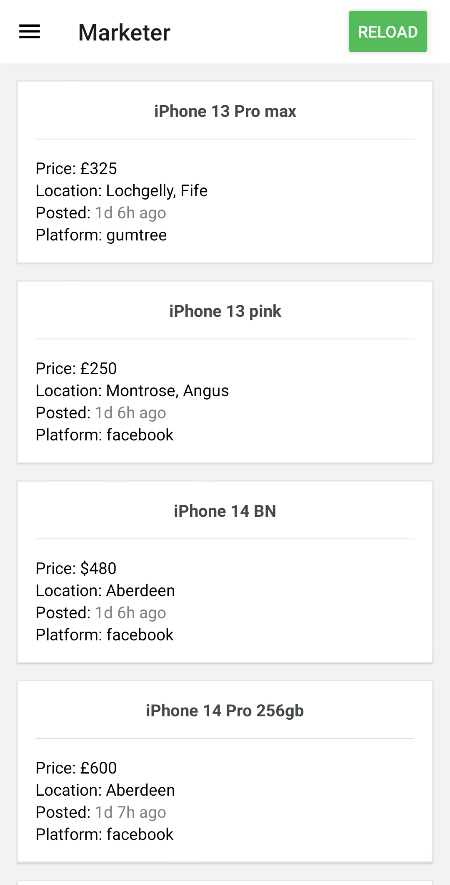

> **Note:** This is my first application, so obviously might have security or any other issues.
> This server only works for uk. I might extend it in near future.
# Marketer
Mobile app, a tool for private seller enthusiasts to receive frequent notifications from Facebook and Gumtree. It works in conjunction with a [WebScrap-Server](https://github.com/Stipecim/WScrap-Marketer) and cannot function without it.



## Installation
Download Marketer.apk from repository and run.

## Usage
Before using the app, you need to set up the [WebScrap-Server](https://github.com/Stipecim/WScrap-Marketer) After that, run the server.
Open Settings and enter your public IP or DNS server `e.g 43.22.33.12`, You do not need to include the port number.


## Development Enviroment Setup
After cloning repository

Install node dependencies/packages. Make sure that you are using `Node version v16`[Node Version Manager](https://github.com/nvm-sh/nvm) as `expo-cli` is not compatible with the `latest versions` 

```sh
npm install
```

You will need to add `google-services.json` to `app/` directory, to obtain `json` file you will need to create project at [Firebase Console](https://console.firebase.google.com/) 
and connect it with expo notification service [Expo Dev](https://expo.dev/) I will not go into any details how to set up as there are plentifull tutorials on the internet.

To run:
```sh
npm start
```

To compile you will need to 
```sh
npm install -g eas-cli
# after that run
npx eas build -p android --profile preview
```

For the `server` env setup go to [WebScrap-Server](https://github.com/Stipecim/WScrap-Marketer).

## Contribution 
If you find any issues or have suggestions please feel free to open an issue or a pull request.
